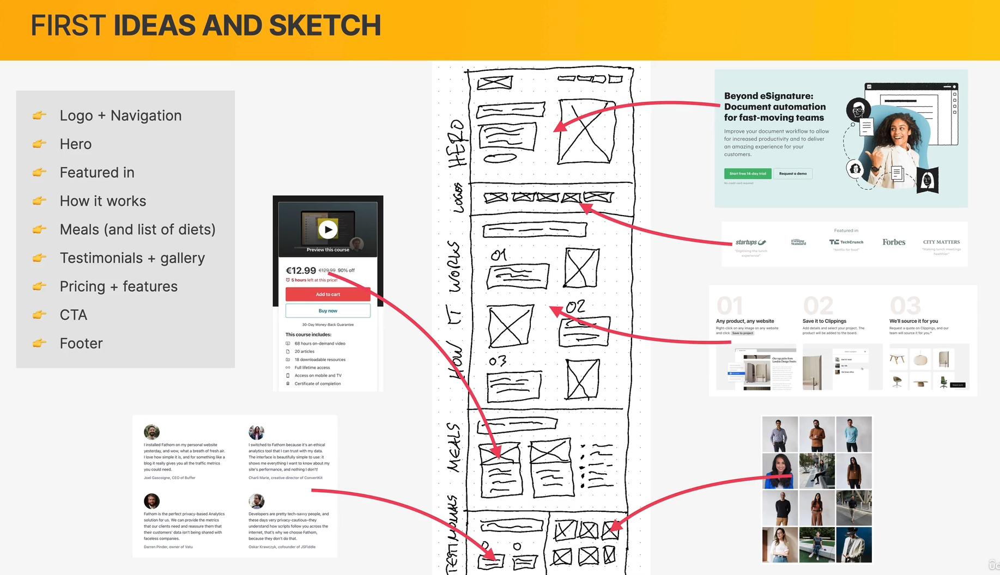
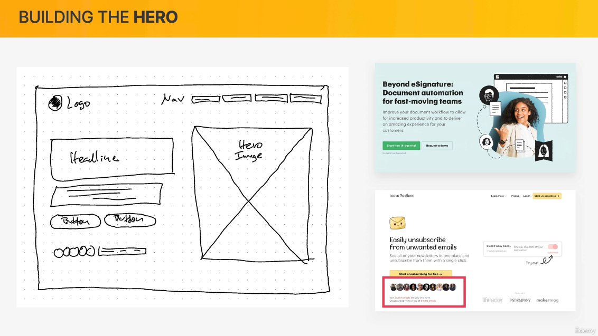
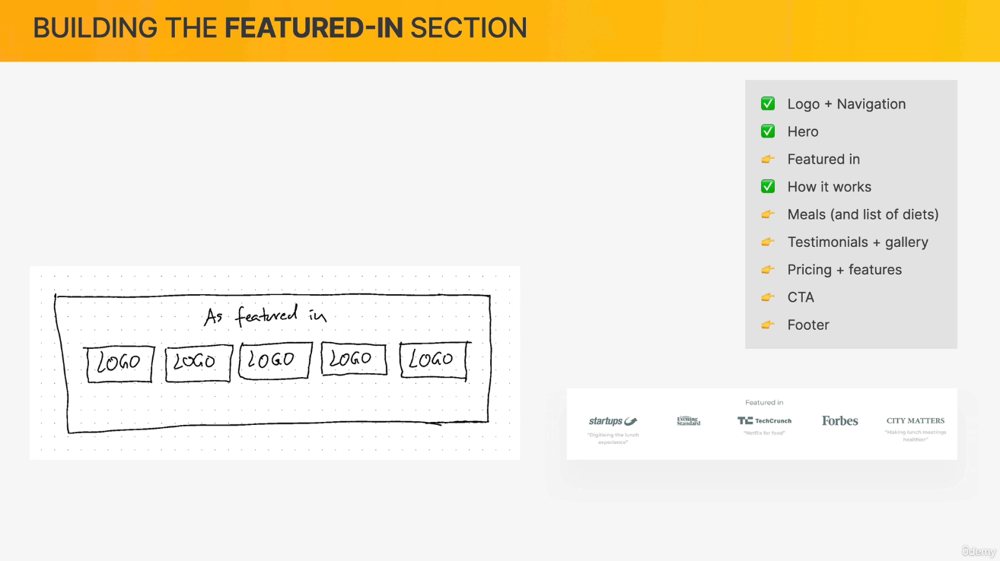
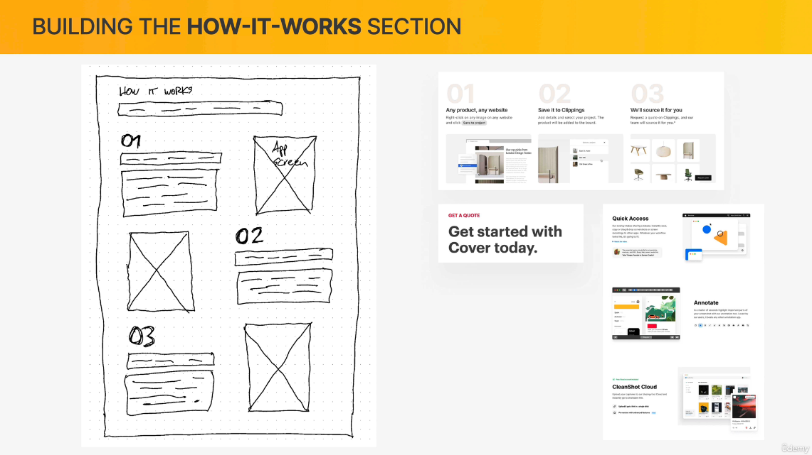
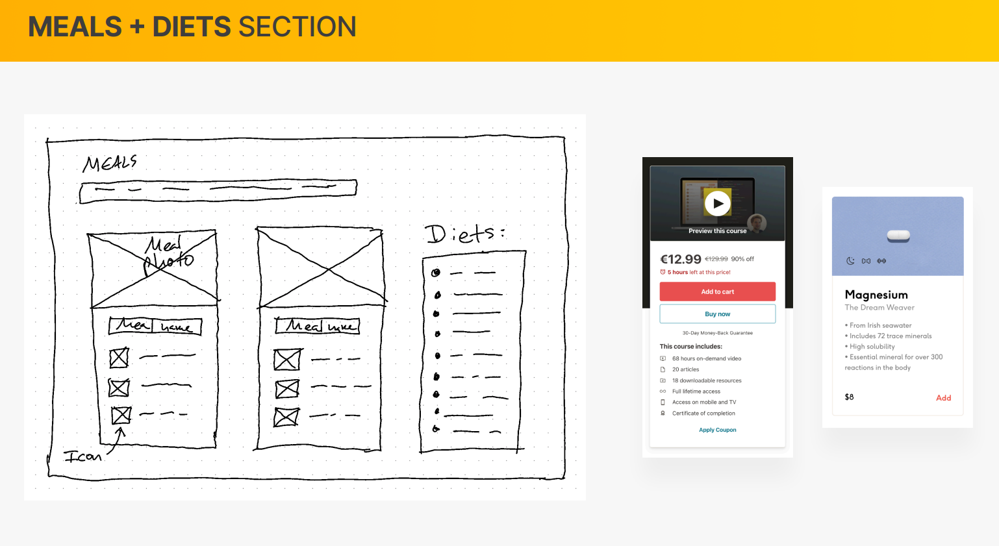
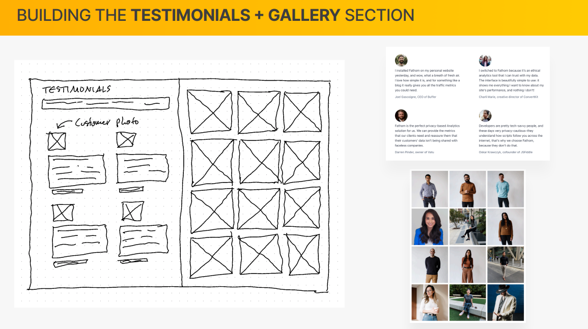
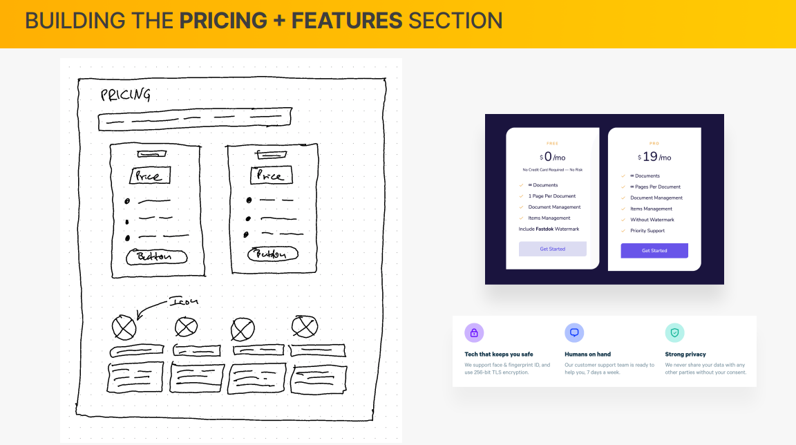
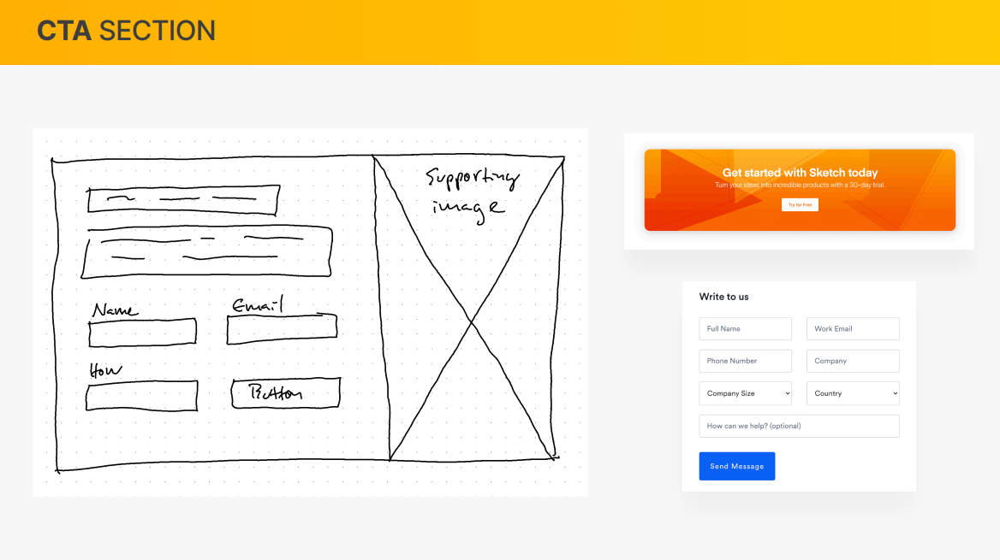
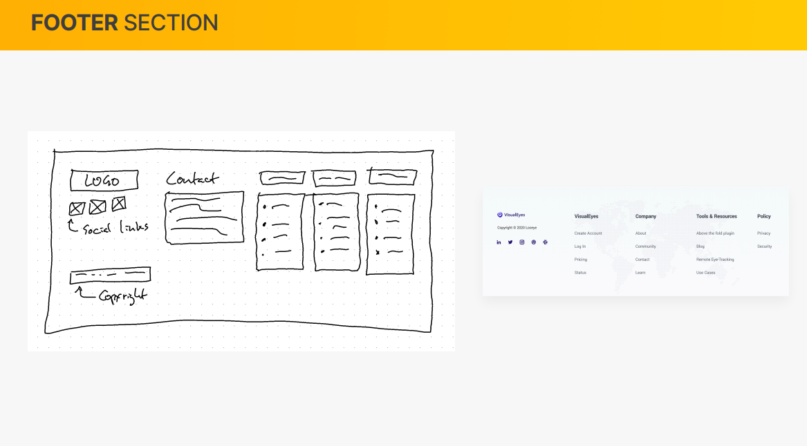

# Omnifood_Project

**If you have some problems with the Website, Github Pages, Responsive or many more, please report them on the issues section of the Github repository [here](https://github.com/LucasMadranges/Omnifood_Project/issues). Thanks !**

## Thanks ❤

Project made with the [Build Responsive Real-World Websites with HTML and CSS course](https://www.udemy.com/course/design-and-develop-a-killer-website-with-html5-and-css3/) on Udemy. Thanks to the author [Jonas Schmedtman (Personnal WebSite)](https://codingheroes.io/index.html) ! This is a very good course for learn HTML and CSS.

## Every Step for build this WebSite

In this section, I talk about the steps I learn for create the project. This repository in principaly for help me in the future, but you can use it to help you as well.

### Step 1 : Defining the project

- WHO : For a client.
- WHAT :
  - Business goal : Selling monthly food subscription.
  - User goal : Eating well effortlessly, without spending a lot of time and money.
- TARGET AUDIENCE : Busy people who like technology, are interested in a healthy diet, and have a well-playing job.

### Step 2 : Planning the project

- Plan and gather website content (content.md).
- Plan out the sitemap : It's just a one-page marketing website (landing page), so no sitemap here.
- Define website personality : Based on the tech-centered target audience, as well as the actual product being sold, we will use the **startup/upbeat personality. We might add some elements of the **calm/peaceful\*\* personality, since the product is all about consumer well-being as well. Here a link for all Website personality with all explanation [IPoint Blog](https://www.ipoint.com.mt/blog/website-personality-matters-see-which-one-is-perfect-for-you-and-why/)

### Step 3 : Layout ideas for the project

In this section, I have to find ideas for the project. Here different design you can use for find ideas for a project :

- [Land Book](http://land-book.com/)
- [One Page Love](https://onepagelove.com/inspiration)
- [Awwwards](https://www.awwwards.com/websites/)
- [Screenlane](https://screenlane.com/)
- [Dribble](https://dribbble.com/)

For this project, Jonas, the author of the course, has differents ideas :

### Step 4 : Build the different part of the project

#### 4.1 : Hero section, Header and Navigation

#### 4.2 : Featured-in section

#### 4.3 : How-it-works section

#### 4.4 : Meals + Diets section

#### 4.5 : Testimonials + gallery section

#### 4.6 : Pricing + features section

#### 4.7 : Call-to-action section

#### 4.8 : Footer section

